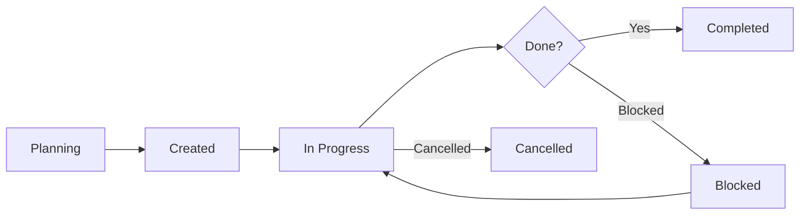

# .agent/tasks — Task Order Definitions

**Directory**: `.agent/tasks/`  
**Purpose**: YAML-based task definitions for phased development work  
**Status**: Active (Established v9.6.2)

---

## 📋 Overview

This directory stores **task order files** — structured YAML documents that define work to be done in a specific sequence. These are not code tasks (like TODO comments), but **project-level work orders** for major development phases.

### Key Concept

> **"A task file is a contract between planning and execution."**

Task files represent:

- What needs to be done
- In what order
- With what priority
- Under what constraints

---

## 📁 Current Tasks

| File | Phase | Status | Created | Completed |
|------|-------|--------|---------|-----------|
| `task_order_phase1.yaml` | Phase 1 | ✅ Complete | v9.6.0 | v9.6.2 |
| `task_order_phase2.yaml` | Phase 2 | ✅ Complete | v9.6.0 | v9.6.2 |
| `task_order_phase3.yaml` | Phase 3 | ✅ Complete | v9.6.0 | v9.6.3 |

---

## 📐 Task File Structure

### Standard Format

```yaml
# task_order_<phase_name>.yaml

phase: <phase_name>
version: <version>
created: <YYYY-MM-DD>
status: planning | in_progress | completed | cancelled

description: |
  <What this phase aims to achieve>

dependencies:
  - <Previous phase or prerequisite>

tasks:
  - id: <unique_id>
    title: <Task title>
    priority: high | medium | low
    status: todo | in_progress | done | blocked
    assigned_to: <system_or_person>
    estimated_time: <hours_or_days>
    dependencies: [<other_task_ids>]
    notes: |
      <Additional context>

completion_criteria:
  - <Criterion 1>
  - <Criterion 2>
```

### Example

```yaml
phase: cognitive_flow_upgrade
version: 9.6.2
created: 2026-01-18
status: in_progress

description: |
  Upgrade from Cognitive Flow 1.0 to Cognitive Flow 2.0

tasks:
  - id: CF2_001
    title: Update CIM to inject files not text
    priority: high
    status: done
    estimated_time: 4 hours
    
  - id: CF2_002
    title: Update flow diagrams
    priority: medium
    status: in_progress
    dependencies: [CF2_001]
```

---

## 🔄 Task Lifecycle



### Status Definitions

| Status | Meaning | Next Action |
|--------|---------|-------------|
| `planning` | Task file exists, tasks not finalized | Define tasks |
| `in_progress` | Actively working on tasks | Execute tasks |
| `completed` | All tasks done | Archive or keep for reference |
| `cancelled` | Work discontinued | Document reason, archive |
| `blocked` | Cannot proceed | Identify blocker, escalate |

---

## 🎯 When to Create a Task File

### ✅ Create a Task File When

- Major feature development (spans multiple files/systems)
- Multi-phase refactoring
- System migrations
- Architecture changes
- Release preparation

### ❌ Don't Create a Task File When

- Bug fixes (use issue tracker)
- Single-file changes
- Documentation updates (unless major overhaul)
- Routine maintenance

**Rule of Thumb**: If it takes more than 1 day and touches 3+ systems, make a task file.

---

## 📂 Organization Guidelines

### File Naming

```
task_order_<identifier>.yaml

Examples:
- task_order_phase1.yaml
- task_order_cognitive_flow_2.0.yaml
- task_order_registry_migration.yaml
```

Use **descriptive identifiers**, not just numbers.

### Archiving Completed Tasks

When a task file is completed:

1. **Update status** to `completed`
2. **Add completion_date** field
3. **Move to** `.agent/tasks/archive/` (create if needed)
4. **Update this README** to reflect archive

---

## 🛠️ How to Use Task Files

### For Developers

1. **Read** the task file to understand scope
2. **Update status** as you work (`todo` → `in_progress` → `done`)
3. **Add notes** for blockers or decisions
4. **Commit** task file updates with related code

### For AI Agents

1. **Parse** YAML to get task list
2. **Filter** by priority and dependencies
3. **Execute** in dependency order
4. **Report** progress via status updates

### For Project Managers

1. **Create** task files during planning
2. **Review** status regularly
3. **Adjust** priorities as needed
4. **Archive** when complete

---

## 📊 Task Metrics (Optional)

Add these fields to track progress:

```yaml
metrics:
  total_tasks: 15
  completed_tasks: 12
  in_progress_tasks: 2
  blocked_tasks: 1
  completion_percentage: 80
  estimated_total_time: 40 hours
  actual_time_spent: 35 hours
```

---

## 🔗 Related Tools

| Tool | Purpose | Integration |
|------|---------|-------------|
| `.agent/workflows/` | Reusable processes | Workflows reference task files |
| `docs/00_Governance/CHANGELOG.md` | Release notes | Completed tasks → CHANGELOG entries |
| `registry/version_log.yaml` | Version tracking | Phase completion → version bump |

---

## 📖 Template

Create new task files from this template:

```yaml
# task_order_<your_phase_name>.yaml

phase: <phase_name>
version: <current_version>
created: <YYYY-MM-DD>
status: planning

description: |
  <What this phase accomplishes>

dependencies: []

tasks:
  - id: <PHASE_001>
    title: <First task>
    priority: high
    status: todo
    estimated_time: <N hours>

completion_criteria:
  - <Success criterion>
```

Save as: `task_template.yaml` (coming soon)

---

## 🏁 Status

**Total Task Files**: 3  
**Completed**: 2  
**In Progress**: 1  
**Last Updated**: 2026-01-19

**Next Steps:**

- Create `task_template.yaml`
- Create `archive/` subdirectory
- Add task metrics to existing files

---

*Task files are the roadmap. Keep them updated.*
