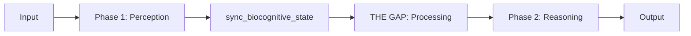

# EVA Consciousness (Awareness Domain)

**Directory**: `consciousness/`  
**Purpose**: The working memory, state, and active interface for the LLM.  
**Version**: v9.6.2 (Cognitive Flow 2.0)

---

## 📋 Overview

The **Consciousness Domain** is the "RAM" of the EVA organism. It is the primary area where the LLM reads state, manipulates context, and performs its reasoning loops. Unlike the immutable `memory/` archive, `consciousness/` is dynamic and turn-based.

---

## 📂 Multi-Layered Architecture

### 1. `context_container/` (The Active Slot)

The most critical workspace. This folder contains the **Active Context Container** for the current turn.

- [**Instructions**](file:///e:/The%20Human%20Algorithm/T2/agent/consciousness/context_container/instructions.md): System prompt and constraints.
- [**Chat History**](file:///e:/The%20Human%20Algorithm/T2/agent/consciousness/context_container/chat_history.md): Rolling window of turns.
- [**Injectors**]: Dynamic files injected by CIM (Context Injector Module).

### 2. `state_memory/` (Biological State)

Real-time JSON snapshots of the system organs.

- `physio_core_state.json`: Vitals and Hormones.
- `eva_matrix_state.json`: Emotional 9D Matrix.
- `artifact_qualia_state.json`: Phenomenological Texture.

### 3. `episodic_memory / semantic_memory / sensory_memory`

The "Hot" memory caches for the current session before they are archived to MSP.

### 4. `services / skills / tools`

Contains **Shortcuts (.lnk or wrappers)** to the actual implementations in the `capabilities/` directory.

---

## 🌀 Cognitive Flow (v9.6.2)

## ⚖️ Governance

- **Mutable Access**: The LLM has direct read/write access to this directory.
- **Cleanup Law**: Turn-specific data in `context_container/` is purged or archived after every turn.
- **Latching**: State memory is "latched" to MSP by the subconscious observer.

---

*Consciousness is not a static state, but a continuous flow.*
