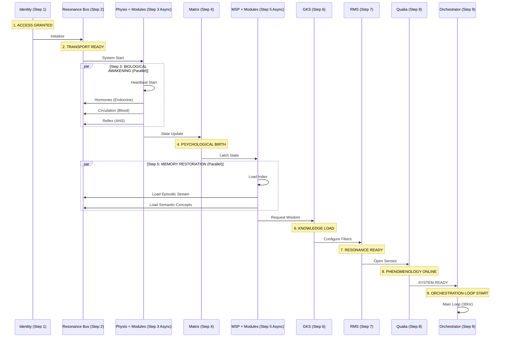

# EVA v9.6.2 Operational Flow (Authoritative)
>
> **Status**: Canonical / Final
> **Version**: 9.6.2 (Registry Refined)
> **Role**: Source of Truth for Runtime Orchestration (Synced with Registry)
> **Companion**: See [Cognitive Flow 2.0](file:///e:/The%20Human%20Algorithm/T2/agent/orchestrator/cognitive_flow/docs/Cognitive_Flow_2_0.md) for logic sequence.

เอกสารฉบับนี้แสดง **Runtime Execution Flow** ที่ถูกกำหนดใน `eva_master_registry.yaml` ซึ่งเป็นจุดอ้างอิงเดียว (SSOT) สำหรับการ Boot และ Execution ของระบบ

---

## 📊 Unified Execution Graph (Registry-Driven)

แผนผังนี้แสดง **Boot Order** (Awakening Sequence) และ **Parallel Execution Groups** ตามที่กำหนดใน Registry:

---

## 🛠️ Runtime Hook Mapping (Configuration Source)

**[IMPORTANT]**: หากต้องการแก้ไขลำดับการทำงาน ให้ไปที่ `registry/eva_master_registry.yaml` หมวด **5. RUNTIME EXECUTION FLOW**.

| Step | System | Mode | Entry Point (Runtime Hook) | Config Source |
| :--- | :--- | :--- | :--- | :--- |
| **1** | Identity_Manager | `serial` | `operation_system.identity_manager` | Registry (`#5`) |
| **2** | Resonance_Bus | `serial` | `operation_system.resonance_bus` | Registry (`#5`) |
| **3** | **PhysioCore Group** | `parallel` | `physio_core.physio_core` (Controller) | Registry (Mod Rules) |
| **4** | EVA_Matrix | `serial` | `eva_matrix.eva_matrix` | Registry (`#5`) |
| **5** | **MSP Group** | `parallel` | `memory_n_soul_passport.engine` | Registry (Mod Rules) |
| **6** | GKS | `serial` | `genesis_knowledge_system.gks_interface` | Registry (`#5`) |
| **7** | RMS | `serial` | `resonance_memory_system.rms` | Registry (`#5`) |
| **8** | Artifact_Qualia | `serial` | `artifact_qualia.artifact_qualia` | Registry (`#5`) |
| **9** | **Orchestrator** | `loop_start` | `orchestrator.orchestrator` | Registry (`#5`) |

## 🔑 Terminology Enforcement (v9.4.3)

* **CIM (Context Injection Module)**: *[REPLACES CIN]* หน่วยงานจัดเตรียม Context ให้ LLM
* **The Gap**: ช่วงเวลาประมวลผลระบบสรีรวิทยาและจิตวิทยาข้าม Token
* **State-Dependent Memory**: การดึงความจำที่เน้นความสอดคล้องกับอารมณ์ความรู้สึกปัจจุบัน
* **Hydrate**: (State) การกู้คืนสภาวะความจำเก่าลงสู่ Consciousness โดย MSP/RAG
* **Contextualize**: (Process) การปรับปรุงบริบทของเทิร์นปัจจุบันด้วยข้อมูลจากความจำถาวร
* **Engram**: หน่วยความจำรีเฟล็กซ์ที่ทำงานระดับ O(1)

---

<!-- markdownlint-disable-next-line MD036 -->
**Created for EVA v9.4.3 Implementation**
