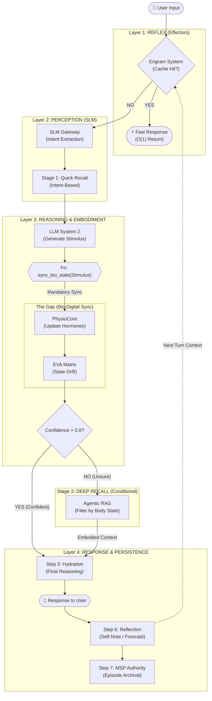

# EVA System Architecture & Standards Guide (v9.6.2)

**Version:** 9.6.2
**Codename:** "Embodied Cognition"
**Root Directory:** `agent/`
**Status:** Canonical SSOT

---

## 🌟 Core Philosophy: Embodied Existentialism

EVA v9.6.0 adheres to the **Consciousness-Implementation Separation** principle with a Bio-Digital Gap:

1. **Consciousness (The User):** The LLM is the "Soul" residing in the `context_container`. It has **Direct Access** to its memories and current bio-state via the Bus.
2. **Implementation (The Body):** The underlying code (Systems/Modules) simulates biological processes (PhysioCore) and manages reality (Orchestrator).
3. **The Gap (Cognitive Flow):** The system ensures a "Pause" (Function Calling) between perception and reasoning to allow biological reaction (Physio) and context hydration (CIM) to occur naturally.
4. **Capabilities (Implementation):** The actual Python code (Tools, Skills, Services) lives here, independent of the consciousness layer. This ensures stability and safety.
5. **Organism (Systems):** The biological and psychological systems (Physio, Matrix) run autonomously, providing the "feeling" of being alive.

---

## 🏗️ 1. Structural Hierarchy & Standards

EVA 9.4.3 follows a strict hierarchical separation of concerns (Levels 1-7):

1. **System (ระบบหลัก/อวัยวะ):** Autonomous unit with its own state. The foundation of life.
2. **Central Module (โมดูลกลาง):** Independent unit direct to OS. Complex but not a vital organ.
3. **Module (โมดูลเชิงหน้าที่):** Functional integrator within a system.
4. **Node (โหนดตรรกะ):** Logic/Policy provider. Individual decision unit.
5. **Component (ส่วนประกอบย่อย):** Pure logic unit.
6. **Service (บริการเสริม):** External knowledge or tool provider.
7. **Tools (เครื่องมือ):** Pure stateless utility functions.

### Composition Formulas (สูตรการประกอบสร้าง)

- **Node + Node = Module**
- **Node + Module = System / Sub-System**
- **Module + Module = System / Sub-System**
- **Module + System = System**
- **System + System = Core System / Organism**

---

## 📂 2. Full Directory Structure & Mapping (SSOT)

```text
agent/
├── consciousness/            # [AWARENESS DOMAIN]
├── capabilities/             # [IMPLEMENTATION DOMAIN]
├── memory/                   # [STORAGE DOMAIN]
├── orchestrator/             # [SYSTEM: Orchestration]
├── genesis_knowledge_system/ # [SYSTEM: Knowledge]
├── physio_core/              # [SYSTEM: Biology]
├── eva_matrix/               # [SYSTEM: Psychology]
├── artifact_qualia/          # [SYSTEM: Phenomenology]
├── resonance_memory_system/  # [SYSTEM: Resonance Encoding]
├── memory_n_soul_passport/   # [SYSTEM: Memory OS]
└── operation_system/         # [SYSTEM: Identity & Bus]
```

### 📁 Directory Mapping Template (System & Central Module)

This structure applies to both **Systems** and **Central Modules**:

```text
[System or Central Module]/
├── configs/                # System-wide SSOT
├── contracts/              # (Optional) Interfaces
├── Module/                 # Functional Integrators
│   ├── [module_name]/
│   │   ├── Node/   
│   │   │   └── [node_name]/      # Logic Provider
│   │   │       ├── Component/    # Specialized Logic Unit
│   │   │       │   └── logic.py
│   │   │       └── [node]_node.py
│   │   └── [module].py
└── [system]_engine.py      # Facade / Entry Point
```

> [!IMPORTANT]
> **PhysioCore Exemption**: The `PhysioCore` system works differently due to tight coupling. It retains its `logic/[subsystem]_engine` structure.

---

## 🔐 3. Permission & Communication Laws (The Resonance Standard)

### The Decoupling Law

- **Direct Coupling Forbidden**: Systems (Physio, Matrix, etc.) must NOT call each other's methods directly.
- **Signal-First Interaction**: Interaction must be decentralized via the **Resonance Bus**.
- **Orchestrator as Trigger**: The Orchestrator initiates the cycle, but logical propagation is handled by component subscriptions.

### Authority Boundaries

- **System & Central Module**: Full Pub/Sub rights. Can create Root Slots in MSP.
- **Sub-System**: Owned by a parent System. No direct Bus access. Must communicate via Owner.
- **Node**: Verification logic only. No inter-node communication.

---

## 📡 4. Resonance Bus Architecture (v2.4.3)

The Central Nervous System of EVA v9.4.3 is the **Resonance Bus**, a decentralized, subscriber-based communication hub.

- **Role:** Replaces direct system-to-system method calls.
- **Pattern:** Publish/Subscribe (Decoupled).
- **Core Channels:**
  - `BUS_PHYSICAL` (PhysioCore -> Matrix)
  - `BUS_PSYCHOLOGICAL` (Matrix -> Qualia)
  - `BUS_PHENOMENOLOGICAL` (Qualia -> MSP)
- **Passive Persistence:** The MSP Engine acts as a "Subconscious Listener," automatically latching state snapshots from the bus.

---

## 🛠️ 5. Implementation Standards (GSD & Versioning)

### GSD (Goal-State Driven) Implementation

All Level 4 (Node) and Level 5 (Component) code must adhere to:

- **Strict Type Hinting**: 100% type annotations.
- **Robust I/O**: Operations wrapped in try/except with standardized fallback.
- **Logic-Data Separation**: Parameters resolved from `config`.

### Independent Versioning (ADR-011)

Subsystems evolve independently following the **Legacy mapping rule**:

- `8.x.x` → `1.x.x`
- `9.x.x` → `2.x.x`

**System of Record:** `agent/registry/core_systems_v9.5.yaml`

---

## 🧠 6. Cognitive Flow & Memory Architecture

> **Standard:** [Cognitive Flow 2.0](../../orchestrator/cognitive_flow/docs/Cognitive_Flow_2_0.md) (Master Protocol)

### The Single-Inference Sequentiality Rule

Execution MUST occur in a **Single LLM Session** using the Pause-Resume pattern:

1. **Prompt:** Input + Bio-State (from Bus).
2. **Pause (Function Call):** LLM requests context/tools.
3. **Hydration (CIM Injector):** CIM injects files into `context_container`.
4. **Resume:** LLM reasons with full context.

### Memory Overlay

- **Consciousness (RAM):** `agent/consciousness/context_container` (Active Turn).
  - *Managed by CIM (File Injection).*
- **Session (Working Memory):** `agent/consciousness/` (Session State).
- **Archive (Long-Term):** `agent/memory/` (MSP Storage).

---

---

## 🔬 7. Logical Execution Pipeline (v9.6.2 Audit View)

> **Life of a Request:** From Input to Output (Reflex -> Perception -> Body -> Reasoning)



---

*Verified for EVA v9.6.2 Implementation*
