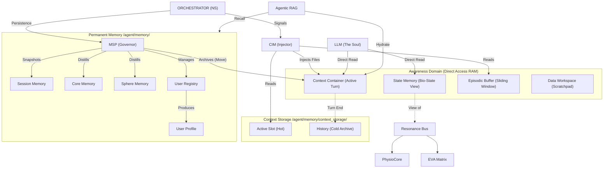

# EVA System Storage & Entity Relationships (v9.6.2)
>
> **Status**: Canonical / v9.6.2
> **Role**: MSP Storage Governance & Data Ownership Map on Cognitive Flow 2.0
> **Standard**: [Cognitive Flow 2.0](../../orchestrator/cognitive_flow/docs/Cognitive_Flow_2_0.md)

เอกสารฉบับนี้แสดงโครงสร้างการถือครองข้อมูล (Data Ownership) ภายใต้การกำกับดูแลของ **MSP (Memory & Soul Passport)** และ **Cognitive Flow 2.0**

---

## 1. MSP Storage Governance Diagram (ERD v9.6.2)

---

## 2. Entity Definitions (v9.6.2)

### 2.1 CIM (Context Injector Module)

- **Role**: **"File Injector"**. ไม่ได้สร้าง Text Prompt แต่ทำหน้าที่ Copy ไฟล์ข้อมูล (Input, Rules, Bio-State, Memory) ลงใน `Context Container`
- **Action**: Hydration (ฉีดข้อมูลให้พร้อมสำหรับ LLM)

### 2.2 Context Container (The Vessel)

- **Concept**: **"Active Turn Object"**. เป็นเสมือน Folder ชั่วคราวใน RAM ที่รวบรวมทุกอย่างที่จำเป็นสำหรับการตัดสินใจใน 1 Turn
- **Contents**: `task.md`, `self_note.md`, `user_profile.md`, `prompt_rules/`

### 2.3 Context Storage (The Desk)

- **Active Slot (Hot)**: พื้นที่วางงานปัจจุบัน (Reference)
- **History (Cold)**: ตู้เก็บเอกสารเก่า (Archived Turns)
- **Rule**: เมื่อจบ Turn, Dynamic Content ใน Container จะถูกย้าย (Move) ไปลง History

### 2.4 User Registry (The Identification)

- **Role**: **"Identity Manager" สำหรับผู้ใช้**. จัดการการลงทะเบียนและระบุตัวตน (Speaker identification)
- **Storage**: `/agent/memory/user_registry.json`
- **Output**: สร้าง `user_id` (เช่น `FD_01`, `U_01`) และบริหารจัดการ `User Profile`

### 2.4 Consciousness (Direct Access RAM)

- **Definition**: พื้นที่ที่ LLM "มองเห็น" ได้ด้วยตาตัวเอง (ผ่าน Function Call / File Read) โดยไม่ต้องผ่านคนกลาง
- **Components**:
  - **Context Container**: สิ่งที่ต้องคิดตอนนี้
  - **State Memory**: ความรู้สึกตอนนี้ (Bio-State)
  - **Episodic Buffer**: ความจำระยะสั้น (5 Turns ล่าสุด)
  - **Data Workspace (`data/`)**: พื้นที่ทำงานชั่วคราว (Transient Scratchpad) สำหรับไฟล์อัปโหลดหรือไฟล์ที่สร้างจากโค้ด

---

## 4. Consciousness vs Subconscious Separation (ADR-016)

> **Constitutional Principle**: The LLM cannot write to `memory/` (Subconscious)

### 4.1 The Two Domains

| Domain | Path | LLM Control | Nature | Tools |
| :--- | :--- | :--- | :--- | :--- |
| **Consciousness** | `agent/consciousness/` | ✅ Read/Write | Working Memory, Active Awareness | CRUD, grep, file_ops |
| **Subconscious** | `agent/memory/` | ❌ MSP-only Write | Long-term, Automatic | RAG (read-only) |

### 4.2 Why This Matters

**Can the LLM "stop thinking" about something?**  
→ **No.** Just like humans cannot forcefully stop intrusive thoughts or force themselves to remember/forget long-term memories.

**Architectural Enforcement**:

- **consciousness/**: LLM has full CRUD access → This is the "scratch pad"
- **memory/**: Only MSP can write → This is the "filing cabinet"
  - LLM can **propose** episodic memory → MSP validates and persists
  - LLM can **read** via RAG → Retrieval is safe (one-way flow)
  - LLM **cannot** delete or modify archived content

**Prevents**:

1. LLM "lobotomizing" itself by deleting critical memories
2. Context hallucination (LLM modifying the 5-turn window)
3. Breaking identity continuity across sessions

**See**: [ADR-016: Consciousness vs Subconscious Separation](file:///e:/The%20Human%20Algorithm/T2/agent/docs/adr/016_consciousness_subconscious_separation.md)

---

## 5. Why This ERD is "Stable"?

โครงสร้างนี้เสถียรเพราะมันใช้หลักการ **"Single Writer, Multiple Reader"**:

- **MSP** เป็นคนเดียวที่เขียนลง LTM ได้ (Single Source of Authority)
- **Agentic RAG** เป็นคนดึงข้อมูลมาใช้ (Read Only)
- **CIM** เป็นคนประกอบข้อมูลส่งให้ LLM
- **LLM** มีสิทธิ์เต็มใน `consciousness/` แต่ไม่สามารถเขียนลง `memory/` โดยตรง

**สรุปการอัปเกรดจาก 9.2 -> 9.4:**
เราเปลี่ยนจากการเก็บรวมๆ ใน `episodic_memory` มาเป็นการแยกหมวดหมู่ตาม **"ลำดับความสำคัญของตัวตน"** (Core vs Sphere vs Session) ซึ่งช่วยให้การดึงข้อมูล (Retrieval) แม่นยำขึ้น

และเพิ่ม **Domain Separation** (Consciousness vs Subconscious) เพื่อป้องกันการควบคุมหน่วยความจำระยะยาวโดยตรงจาก LLM
