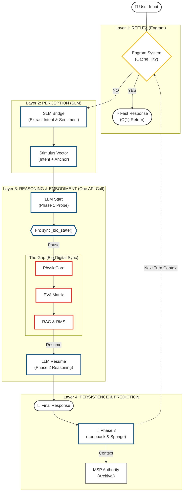

# EVA v9.6.2 Full System Architecture Diagram 🛰️

**Date:** 2026-01-18
**Status:** ✅ **LOGICAL PIPELINE (AUDIT VIEW)**
**Version:** 9.6.2
**Role:** Life of a Request (Input to Output)

---

This diagram visualizes the **Logical Execution Path** of a single user interaction, detailing **Reflex (Fast)**, **Perception (Intent)**, **Embodiment (Gap)**, and **Reasoning (Slow)** layers. Designed for **Logic Auditing**.

## 🧠 Logical Pipeline: The Life of a Request

---

## 🔍 Logic Flow Explanation (Audit Checklist)

1. **Reflex Layer (Engram)**:
    * **Engram System**: ตรวจสอบ Cache ก่อนเข้าสู่ Perception
    * **Hit**: ตอบกลับทันที (O1 Fast Response)
    * **Miss**: ส่งต่อให้ SLM (Deep Process)

2. **Perception Layer (SLM)**:
    * **SLM Bridge**: แปลง Input เป็น `Stimulus Vector` (Intent/Sentiment)
    * **No Hallucination**: ใช้ Llama-3.2 1B เพื่อ Cross-check เจตนา

3. **Reasoning & Embodiment (The Gap)**:
    * **LLM Phase 1**: รับ Stimulus -> ตัดสินใจเรียก Tool `sync_bio_state`
    * **The Gap**:
        * **PhysioCore**: ร่างกายตอบสนอง (หัวใจ/ฮอร์โมน)
        * **Matrix**: อารมณ์เปลี่ยน (Drift)
        * **Retrieval**: ดึงความจำด้วย "อารมณ์" เป็น Key
    * **LLM Phase 2**: รับข้อมูล Embodied State ทั้งหมดแล้วตอบสนอง

4. **Prediction & Persistence**:
    * **Loopback**: ส่ง Context Family และ Self-Note กลับไปที่ CIM (Turn หน้า)
    * **MSP**: บันทึก Episode ลงฐานข้อมูลถาวร

---

> **Note**: Diagram นี้เน้น **Logic Flow** ตามที่ User ต้องการ (Input -> Reflex -> Perception -> Body -> Reasoning) ไม่ใช่ System Topology.
