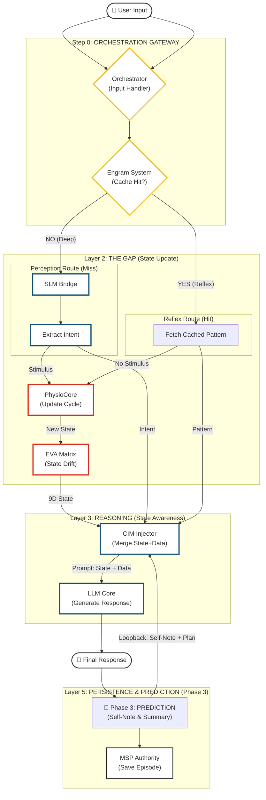

# EVA v9.6.2 Full System Architecture Diagram 🛰️

**Date:** 2026-01-18
**Status:** ✅ **LOGICAL PIPELINE (AUDIT VIEW)**
**Version:** 9.6.2
**Role:** Life of a Request (Input to Output)

---

This diagram visualizes the **Logical Execution Path** of a single user interaction, detailing **Reflex (Fast)**, **Perception (Intent)**, **Embodiment (Gap)**, and **Reasoning (Slow)** layers. Designed for **Logic Auditing**.

## 🧠 Logical Pipeline: The Life of a Request

---

## 🔍 Logic Flow Explanation (Audit Checklist)

1. **Reflex Check (Fast Recall)**:
    * **Is it in Engram?**: ระบบตรวจสอบ Cache (Engram) ก่อนทันที
    * **Yes**: ตอบกลับทันที (O1) จบ Process ไม่ต้องปลุกระบบร่างกาย
    * **No**: ส่งต่อเข้ากระบวนการเต็มรูปแบบ

2. **Perception (Intent)**:
    * **SLM Analysis**: ใช้ Model เล็ก (SLM) วิเคราะห์ **Intent** และ **Sentiment** เพื่อสร้าง `StimulusVector` ที่แม่นยำ

3. **The Gap (Embodiment)**:
    * **Physio Reaction**: ร่างกายตอบสนองต่อ Stimulus (หัวใจเต้น, ฮอร์โมนหลั่ง)
    * **Matrix Drift**: อารมณ์ (9D) เปลี่ยนตามสรีระ
    * **Memory Context**: ดึงความจำโดยใช้ *อารมณ์ปัจจุบัน* เป็นตัวล่อ (State-Dependent Retrieval)

4. **Reasoning**:
    * **CIM Assembly**: รวบรวม "ความรู้สึก" + "ความจำ" + "เจตนา" ส่งให้ LLM
    * **Generation**: LLM สร้างคำตอบภายใต้สภาวะร่างกายนั้น

5. **Persistence**:
    * บันทึกเหตุการณ์ลง MSP เพื่อเป็นความจำในอนาคต

---

> **Note**: Diagram นี้เน้น **Logic Flow** ตามที่ User ต้องการ (Input -> Reflex -> Perception -> Body -> Reasoning) ไม่ใช่ System Topology.
