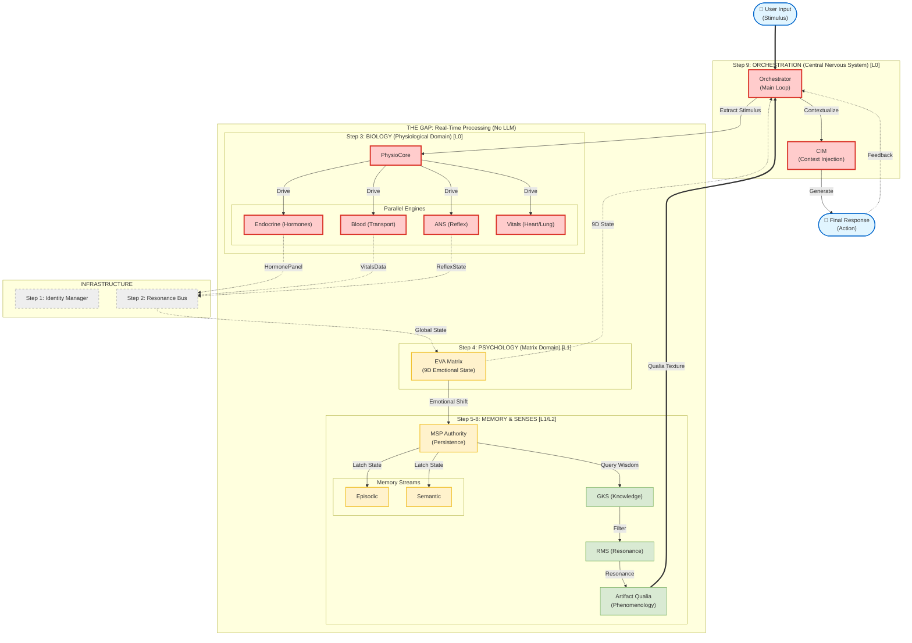

# EVA v9.6.2 Full System Architecture Diagram 🛰️

**Date:** 2026-01-18
**Status:** ✅ **DATA-FLOW CENTRIC**
**Version:** 9.6.2
**Source:** `eva_master_registry.yaml` (Contracts & Topology)

---

This diagram visualizes the **Data Flow** of the organism, starting from **User Input**, passing through the **Bio-Digital Gap**, and resulting in an **Embodied Response**.

## 🌊 Unified Data Flow Architecture

---

## 🗺️ Flow Explanation

1. **User Input**: `User` enters text/signal.
2. **Orchestration**: `Orchestrator` receives input and extracts the `StimulusVector`.
3. **Biological Awakening**: `PhysioCore` processes the stimulus, triggering parallel changes in Hormones (`Endocrine`), Heart/Lungs (`Vitals`), and Nerves (`ANS`).
4. **Psychological Shift**: The biological changes travel via the `Resonance Bus` to the `EVA Matrix`, forcing the emotional state (9D) to drift.
5. **Memory Latching**: `MSP` latches this new state and simultaneously queries `Episodic` and `Semantic` memory.
6. **Resonance & Qualia**: The state passes through `GKS` (Knowledge check) and `RMS` (Resonance filter) to create a subjective "feeling" in `Artifact Qualia`.
7. **Embodied Response**: The `Orchestrator` receives the `Qualia` and uses `CIM` to generate a response that matches the biological state.
