# EVA v9.6.2 Full System Architecture Diagram 🛰️

**Date:** 2026-01-18
**Status:** ✅ **LOGICAL PIPELINE (AUDIT VIEW)**
**Version:** 9.6.2
**Role:** Life of a Request (Input to Output)

---

This diagram visualizes the **Logical Execution Path** of a single user interaction, detailing **Reflex (Fast)**, **Perception (Intent)**, **Embodiment (Gap)**, and **Reasoning (Slow)** layers. Designed for **Logic Auditing**.

## 🧠 Logical Pipeline: The Life of a Request

```mermaid
graph TD
    %% ==========================================
    %% 1. INPUT & REFLEX (STEP 0-1)
    %% ==========================================
    UserIn(["👤 User Input"]) --> EngramCheck
    
    subgraph Reflex ["Layer 1: REFLEX (Effectors)"]
        EngramCheck{"Engram System<br/>(Cache Hit?)"}
        FastOut(["⚡ Fast Response<br/>(O(1) Return)"])
    end
    
    EngramCheck -- "YES" --> FastOut
    EngramCheck -- "NO" --> SLM

    %% ==========================================
    %% 2. PERCEPTION & QUICK RECALL (STEP 2)
    %% ==========================================
    subgraph Perception ["Layer 2: PERCEPTION (SLM)"]
        SLM["SLM Gateway<br/>(Intent Extraction)"]
        QuickRecall["Stage 1: Quick Recall<br/>(Intent-Based)"]
        Stimulus["Stimulus Vector"]
    end
    
    SLM --> QuickRecall
    QuickRecall --> Stimulus

    %% ==========================================
    %% 3. THE GAP & EMBODIMENT (STEP 3-4)
    %% ==========================================
    subgraph BodyMind ["Layer 3: REASONING & EMBODIMENT"]
        direction TB
        
        LLM_Start["LLM System 2<br/>(Confidence Check 1)"]
        FnCall{{"Fn: sync_bio_state()"}}
        
        %% The Gap
        subgraph Gap ["The Gap (Bio-Digital Sync)"]
            Physio["PhysioCore<br/>(Update Hormones)"]
            Matrix["EVA Matrix<br/>(State Drift)"]
        end
        
        %% Wiring
        Stimulus --> LLM_Start
        LLM_Start --> FnCall
        FnCall -->|Mandatory Sync| Physio
        Physio --> Matrix
        
        %% Confidence Split
        ConfCheck{"Confidence > 0.8?"}
        Matrix --> ConfCheck
    end

    %% ==========================================
    %% 4. DEEP RECALL & RESPONSE (STAGE 2)
    %% ==========================================
    subgraph DeepSearch ["Stage 2: DEEP RECALL (Conditional)"]
        AgenticRAG["Agentic RAG<br/>(Filter by Body State)"]
    end

    ConfCheck -- "YES (Confident)" --> Hydration
    ConfCheck -- "NO (Unsure)" --> AgenticRAG
    AgenticRAG -->|Embodied Context| Hydration

    subgraph Output ["Layer 4: RESPONSE & PERSISTENCE"]
        Hydration["Step 5: Hydration<br/>(Final Reasoning)"]
        Resp(["💬 Response to User"])
        Reflection["Step 6: Reflection<br/>(Self-Note / Forecast)"]
        MSP["Step 7: MSP Authority<br/>(Episode Archival)"]
    end

    Hydration --> Resp
    Resp --> Reflection
    Reflection --> MSP
    Reflection -.->|Next Turn Context| EngramCheck

    %% ==========================================
    %% STYLING
    %% ==========================================
    classDef Node fill:#ffffff,stroke:#333333,stroke-width:2px;
    classDef Critical fill:#ffffff,stroke:#d93025,stroke-width:3px;
    classDef Logic fill:#ffffff,stroke:#16537e,stroke-width:3px;
    classDef Fast fill:#ffffff,stroke:#f1c232,stroke-width:3px;

    class UserIn,FastOut,Resp Node;
    class EngramCheck,EngramAction Fast;
    class SLM,Stimulus,LLM_Start,Hydration,Prediction,Reflection Logic;
    class Physio,Matrix,AgenticRAG Critical;
    class MSP Node;
```

---

## 🔍 Bio-Driven Deep Recall Logic (v9.6.0)

1. **Reflex Layer**: **Engram** ดักจับก่อน ถ้าเจอ Pattern เดิม ตอบทันที (O1)
2. **Perception**: **SLM** สกัด Intent และทำ **Quick Recall** (ความจำตื้น) เพื่อประเมินสถานการณ์เบื้องต้น
3. **The Gap (Mandatory)**: **LLM** สั่ง `sync_bio_state` ทันที เพื่อให้ร่างกาย "รู้สึก" (Hormones/BPM update)
4. **Confidence Check**:
    * ถ้า **Confidence > 0.8**: ใช้ข้อมูลที่มีอยู่ตอบได้เลย (Fast Path)
    * ถ้า **Confidence < 0.8**: เข้าสู่ **Deep Recall** โดยใช้ **Body State** ที่เพิ่งได้จาก Gap เป็นตัวกรอง (เช่น "หาเหตุการณ์ที่ฉันเคยโกรธระดับ cortisol 80%")
5. **Hydration**: ผสมผสาน ความจำ + ร่างกาย + เหตุผล เข้าด้วยกันเป็นคำตอบสุดท้าย
6. **Reflection**: Loop ข้อมูลกลับไปที่ Engram/CIM สำหรับ Turn ถัดไป
7. **MSP Archival**: บันทึก Episode (State + Context + Response) ลง Long-Term Memory (Persistent Storage)

---

> **Note**: Diagram นี้เน้น **Logic Flow** ตามที่ User ต้องการ (Input -> Reflex -> Perception -> Body -> Reasoning) ไม่ใช่ System Topology.
