# EVA v9.4.3 Operational Flow (Authoritative)
>
> **Status**: Canonical / Final
> **Version**: 9.4.3
> **Role**: Source of Truth for Runtime Orchestration

เอกสารฉบับนี้คือที่รวมของลำดับการทำงาน (Runtime Hook Flow) ของ EVA v9.4.3 ทั้งหมด เพื่อป้องกันความสับสนและเป็นจุดอ้างอิงจุดเดียว (Single Source of Truth) สำหรับการพัฒนาระบบ

---

## 📊 Unified Sequence Diagram (v9.4.3)

แผนผังนี้แสดงขั้นตอนการประมวลผลตั้งแต่การรับข้อมูลจากผู้ใช้ จนถึงการบันทึกความจำถาวร โดยครอบคลุมทั้งเลเยอร์ Reflex, Instinct, Body และ Reasoning

```mermaid
sequenceDiagram
    participant User
    participant Engram as Engram System (O1)
    participant SLM as SLM Perception (P1)
    participant Physio as PhysioCore (Body)
    participant Matrix as EVA Matrix (Psyche)
    participant RAG as Agentic RAG (Memory)
    participant CIM as CIM (Context Injector)
    participant LLM as LLM Reasoning (P2)
    participant MSP as MSP (Persistence)

    User->>Engram: Input Text
    
    alt Engram HIT (Confidence > 0.95)
        Engram-->>CIM: Reflex Hit: Cached Intent + State
    else Engram MISS
        Engram->>SLM: Forward for Intuitive Analysis
        SLM-->>SLM: Extract Intent, Salience, & Gut Vector
        
        rect rgb(45, 30, 30)
            Note over Physio, Matrix: THE GAP (Embodiment)
            SLM->>Physio: Stimulus Injection
            Physio->>Matrix: Hormone Update -> Matrix Drift
            Matrix-->>RAG: 9D State-Dependent Trigger
        end

        rect rgb(30, 45, 30)
            Note over RAG: MEMORY ASSOCIATION
            RAG->>RAG: 7-Stream Recall (Emotion congruence)
            RAG-->>CIM: Retrieved Associative Memories
        end
    end

    CIM->>LLM: Unified Embodied Prompt (Body + Memory + Input)
    
    rect rgb(30, 30, 45)
        Note over LLM: REASONING & PROPOSAL
        LLM->>LLM: Generate Response + Episodic Proposal
        LLM->>MSP: propose_episodic_memory()
    end

    MSP->>MSP: Final RI Calculation & Archival
    MSP-->>User: [RESPONSE] Expressive & Embodied Output
    
    Note over LLM, MSP: PHASE 3: Prediction & Future Intent Buffer
```

---

## 🛠️ Runtime Hook Mapping

| Phase | Component | File Reference | Action / Hook Points |

| Step | System | File | Method Description |
| :--- | :--- | :--- | :--- |
| **0. Reflex** | Engram System | `engram_engine.py` | `lookup(text)` -> Return cached data if hit. |
| **1. Perception** | SLM Gateway | `orchestrator.py` | `process_user_input` -> `slm.extract_intent()` |
| **2. The Gap** | Physio & Matrix | `physio_core.py` | `process_stimulus()` -> Update HPA/ANS axis. |
| **2.1 Association** | Agentic RAG | `agentic_rag.py` | `contextualize(state)` -> Fetch 7-stream memories. |
| **3. Reasoning** | CIM & LLM | `orchestrator.py` | `cim.inject()` -> `llm.generate()` (Phase 2). |
| **4. Persistence** | MSP Engine | `msp_engine.py` | `archive_turn()` -> Save to semantic/episodic store. |

---

## 🔑 Terminology Enforcement (v9.4.3)

* **CIM (Context Injection Module)**: *[REPLACES CIN]* หน่วยงานจัดเตรียม Context ให้ LLM
* **The Gap**: ช่วงเวลาประมวลผลระบบสรีรวิทยาและจิตวิทยาข้าม Token
* **State-Dependent Memory**: การดึงความจำที่เน้นความสอดคล้องกับอารมณ์ความรู้สึกปัจจุบัน
* **Hydrate**: (State) การกู้คืนสภาวะความจำเก่าลงสู่ Consciousness โดย MSP/RAG
* **Contextualize**: (Process) การปรับปรุงบริบทของเทิร์นปัจจุบันด้วยข้อมูลจากความจำถาวร
* **Engram**: หน่วยความจำรีเฟล็กซ์ที่ทำงานระดับ O(1)

---

<!-- markdownlint-disable-next-line MD036 -->
**Created for EVA v9.4.3 Implementation**
