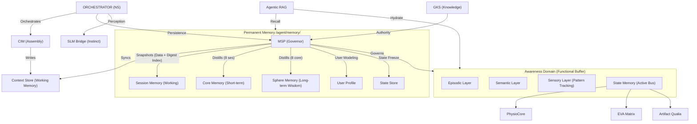

# MSP System Storage & Entity Relationships (v9.4.3)
>
> **Status**: Canonical / v9.4.3
> **Role**: MSP Storage Governance & Data Ownership Map

เอกสารฉบับนี้แสดงโครงสร้างการถือครองข้อมูล (Data Ownership) ภายใต้การกำกับดูแลของ **MSP (Memory & Soul Passport)** ซึ่งเป็นศูนย์กลางการจัดการหน่วยความจำทั้งหมดของ EVA v9.4.3

---

## 1. MSP Storage Governance Diagram (ERD)

---

## 2. Entity Definitions (v9.4.3)

### 2.1 CIM (Context Injection Module)

- **Path**: `agent/memory/context_store/`
- **Role**: ดูแล "ความจำขณะทำงาน" (Working Memory) เพื่อให้ LLM คงความต่อเนื่องในการสนทนา

### 2.2 MSP (Memory & Soul Passport)

- **Path**: `agent/memory_n_soul_passport/`
- **Role**: ผู้ว่าการ (Governor) สูงสุดในการจัดเก็บข้อมูล เป็นคนตัดสินใจว่าข้อมูลไหนควรไปอยู่ที่ไหนใน LTM

### 2.3 The 4 Pillars of Long-Term Memory (LTM)

1. **Core Memory**: เก็บตัวตนพื้นฐาน (Identity Markers) ที่ไม่เปลี่ยนแปลงง่ายๆ
2. **Session Memory**: บันทึก Log ดิบและความทรงจำทั้งหมดที่เกิดขึ้นใน Session โดย MSP จะทำการ Snapshot ทั้งโฟลเดอร์ `consciousness/` ไปเก็บไว้เมื่อจบการทำงาน
3. **Sphere Memory**: เก็บแผนที่ความสัมพันธ์และบริบททางสังคม/สภาพแวดล้อม
4. **User Profile**: การสร้างแบบจำลองของผู้ใช้ (User Modeling) เพื่อสวมบทบาทให้เหมาะสม

### 2.4 Consciousness Domain (Awareness)

- **Episodic**: ความจำเหตุการณ์ใน Session ปัจจุบัน (Active Interaction)
- **Semantic**: ความจำเชิงสัญลักษณ์และความหมายที่กำลังประมวลผล
- **Sensory**: รายละเอียด Qualia ที่แนบมากับเหตุการณ์ปัจจุบัน

---

## 3. Why This ERD is "Stable"?

โครงสร้างนี้เสถียรเพราะมันใช้หลักการ **"Single Writer, Multiple Reader"**:

- **MSP** เป็นคนเดียวที่เขียนลง LTM ได้ (Single Source of Authority)
- **Agentic RAG** เป็นคนดึงข้อมูลมาใช้ (Read Only)
- **CIM** เป็นคนประกอบข้อมูลส่งให้ LLM

**สรุปการอัปเกรดจาก 9.2 -> 9.4:**
เราเปลี่ยนจากการเก็บรวมๆ ใน `episodic_memory` มาเป็นการแยกหมวดหมู่ตาม **"ลำดับความสำคัญของตัวตน"** (Core vs Sphere vs Session) ซึ่งช่วยให้การดึงข้อมูล (Retrieval) แม่นยำขึ้น
