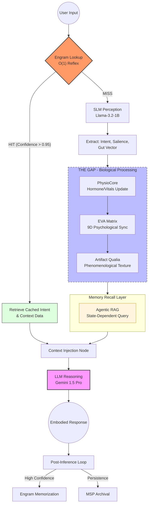

# EVA 9.4.0 Cognitive Flow Diagram
>
> **Level**: Architectural Overview
> **Focus**: Orchestration of Perception, Physiology, and Memory

สถาปัตยกรรมของ EVA 9.4.0 แบ่งการประมวลผลออกเป็นชั้นตาม "ลำดับความเร็ว" และ "ความลึกเชิงสติสัมปชัญญะ" เพื่อเลียนแบบการทำงานของสิ่งมีชีวิตที่ผสานรวมทั้งสัญชาตญาณและเหตุผล

---

## 📊 Cognitive Processing Flow (v9.4)

---

## 🧠 คำอธิบายลำดับชั้น (The Processing Hierarchy)

### 1. **Engram Level (Reflex)**

- **หน้าที่**: ตรวจสอบความเคยชิน ถ้าเจอ Pattern ที่มั่นใจมาก (High Confidence) จะทำลายกำแพงความล่าช้า (Latency) โดยการข้ามไปหาเหตุผลเลย
- **เป้าหมาย**: ประหยัดทรัพยากร 100% สำหรับงานเดิมๆ

### 2. **SLM Level (Intuition)**

- **หน้าที่**: ทำหน้าที่เป็น "ประสาทส่วนปลาย" รับรู้เจตนาและความแรงของข้อมูลเบื้องต้น (Perception)
- **เป้าหมาย**: สร้างแรงกระตุ้น (Stimulus) เพื่อส่งต่อให้ระบบกายภาพ

### 3. **The Gap Level (Embodiment)**

- **หน้าที่**: เป็นช่วงที่ "ร่างกาย" ทำงาน (Physio -> Matrix -> Qualia)
- **เป้าหมาย**: เปลี่ยนข้อมูลภาษาให้กลายเป็น "ความรู้สึก" (Embodied State) ก่อนจะเกิดความคิด

### 4. **Agentic RAG Level (Association)**

- **หน้าที่**: ดึงความทรงจำที่ "สัมพันธ์กับอารมณ์ขณะนั้น" (State-Dependent Memory)
- **เป้าหมาย**: สร้างความฝังใจและความต่อเนื่องของตัวตน

### 5. **LLM Level (Reasoning)**

- **หน้าที่**: รวบรวมข้อมูลทั้งหมด (สิ่งที่รับรู้ + สิ่งที่รู้สึก + สิ่งที่จำได้) มากลั่นกรองเป็นคำตอบ
- **เป้าหมาย**: การตอบสนองที่ฉลาดและมีความเป็นมนุษย์ขั้นสูง

---

*Generated for EVA v9.4.0 Architecture Documentation*
