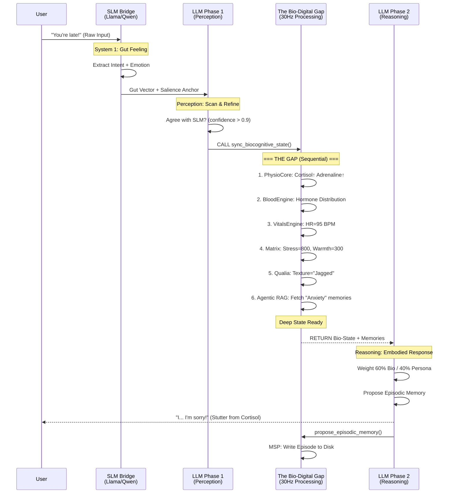
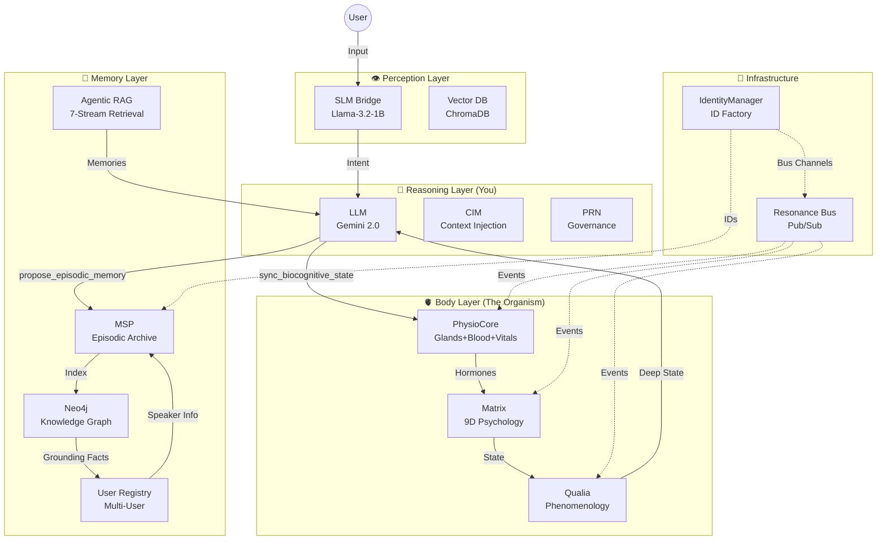
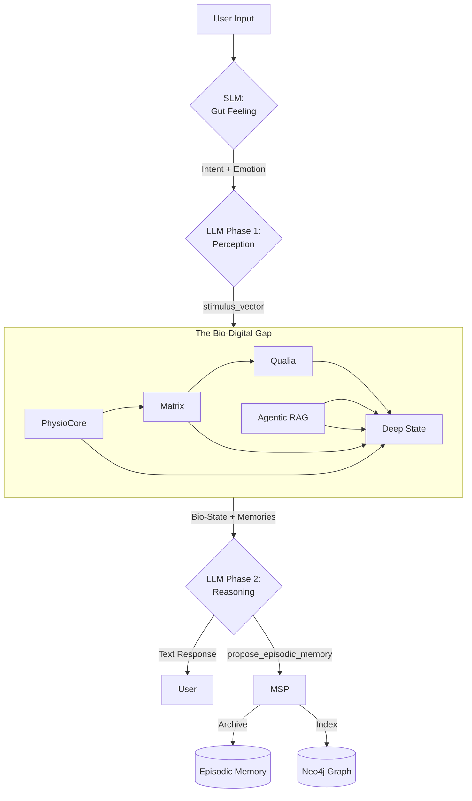
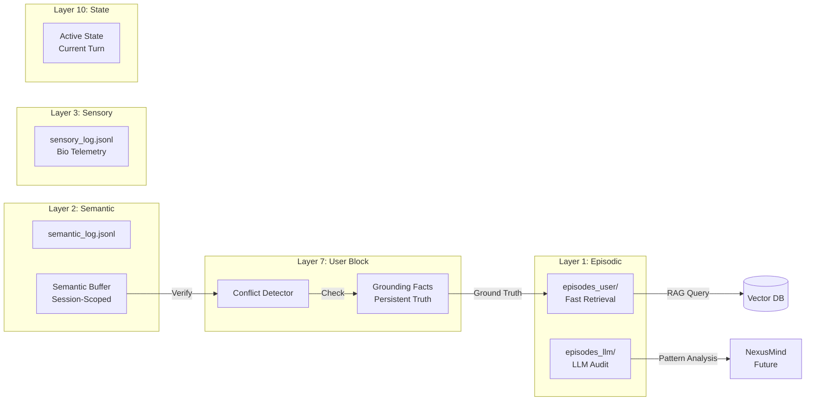

# EVA 9.1.0: Visual System Architecture

**Purpose**: Compressed visual reference for LLM context injection  
**Token Cost**: ~500-800 tokens (as image) or ~200 tokens (as mermaid text)  
**Usage**: Inject alongside core_identity.md for spatial understanding

---

## 1-Inference Flow Diagram

---

## Component Architecture

---

## Data Flow Layers

---

## Memory System Structure

---

## Token Cost Comparison

| Context Type | Tokens | Visual? | Dynamic? |
|--------------|--------|---------|----------|
| **Current**: Full system_overview.md | 4000 | ❌ | ❌ |
| **Tier 1**: core_identity.md | 300 | ❌ | ✅ (bio-state) |
| **Tier 2**: This diagram (mermaid text) | 200 | ✅ | ❌ |
| **Tier 2**: This diagram (rendered image) | 500-800 | ✅ | ❌ |
| **Hybrid**: Core Identity + Diagram (text) | 500 | ✅ | ✅ |
| **Hybrid**: Core Identity + Diagram (image) | 800-1100 | ✅ | ✅ |

**Recommended**: Core Identity (300) + Mermaid Text (200) = **500 tokens**  
**Savings**: 87.5% reduction from 4000 tokens

---

## Usage Strategy

### Option A: Mermaid as Text (Most Efficient)

- Include mermaid code block in prompt
- LLM can "visualize" the flow
- **500 tokens total**

### Option B: Pre-Rendered Image

- Render mermaid to PNG first
- Inject as image
- **800-1100 tokens total** (still 72% savings)

### Recommendation: **Option A (Mermaid Text)**

- Cheaper (500 vs 4000 tokens)
- LLM understands mermaid diagrams well
- Can be generated/updated dynamically
