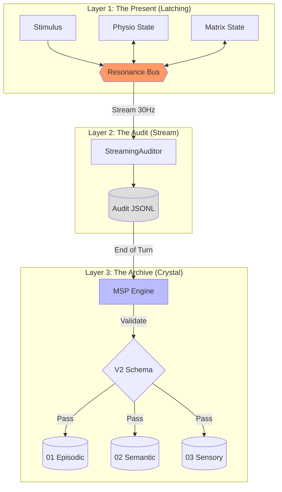

# Resonance Memory System (RMS)
**Component ID:** `ARCH-RMS-9.1` | **Status:** Operational

> [!IMPORTANT]
> **Resonance Memory != MSP**
> *   **MSP (Memory & Soul Passport)** is the *Module* (The Librarian).
> *   **Resonance Memory System (RMS)** is the *Architecture* (The Library + The Flow + The Verification).
> This document defines the **RMS Architecture** for EVA 9.1.0.

## 1. Core Concept: Lived Experience as Hash
In EVA 9.1.0, memory is not just text storage. It is the cryptographic proof of **Lived Experience**.
Every memory entry must satisfy the **Resonance Equation**:
`Memory = (Stimulus + Physio_State + Matrix_State + Qualia) * Time`

## 2. Architecture Layers / Components

### Layer 1: The Latching Stream (Short-Term / Working Memory)
*   **Location**: `Resonance Bus (Active State)`
*   **Role**: Provides immediate context for the next cognitive cycle.
*   **Persistence**: Holds state between ticks (Living Presence), not persisted to disk in this layer.

### Layer 2: The Audit Log (Sensory Buffer)
*   **Location**: `consciousness/audit_logs/audit_log.jsonl`
*   **Role**: "Flight Recorder" / Black Box.
*   **Persistence**: Append-only log of every bus signal.

### Layer 3: The Crystal Archives (Long-Term Memory)
*   **Location**: `e:\The Human Algorithm\T2\EVA 9.1.0\consciousness`
*   **Role**: Permanent storage of validated memories.
*   **Sub-layers**:
    *   **Episodic**: "I remember X happened." (`01_episodic_memory`)
    *   **Semantic**: "I know X implies Y." (`02_semantic_memory`)
    *   **Sensory**: "I remember how X felt." (`03_sensory_memory`)

## 3. Key Metrics & Logic
*   **RIM (Resonance Impact Model)**: Calculates the *Immediate Impact* of an event.
    *   **Low**: Routine background noise (ignored).
    *   **Medium**: Conversational relevance (short-term).
    *   **High**: Emotional/Traumatic event (long-term engraving).
*   **RI (Resonance Index)**: The global "Vibe Score" of the system (0.0 - 1.0).
    *   High RI = High Coherence = Better Memory Encoding.
    *   Computed by `rms.py` merging Bio+Psyche+Context.

## 4. Workflow (Mermaid)



## 5. Integration & Interfaces
1.  **LLM Integration**: The LLM does not write to memory directly. It **Proposes**.
    *   **Proposal**: `MSP_Proposal` sent to the bus.
    *   **Validation**: RMS verifies proposal against Physio State and Audit Log.
2.  **MSP Integration**: RMS provides the logic and metrics (RI/RIM) that the MSP uses to decide what to crystallize.

## 6. Directory Structure
```
resonance_memory_system/
├── configs/                # RMS Configs
│   ├── RMS_Interface.yaml  # Bus bindings & Event hooks
│   ├── RMS_configs.yaml    # Weightings & Thresholds
│   └── RMS_Write_Policy.yaml # (Optional) Persistence rules
├── contract/               # Interface Contracts
│   ├── RMS_Payload_Contract.yaml # Main bus payload spec
│   └── RMS_Snapshot_Proposal.yaml # For state snapshots
├── schema/                 # Validation Schemas
│   ├── RMS_Payload_Schema_v2.json 
│   └── RMS_Snapshot_Schema.json
├── docs/                   # Documentation
│   ├── RESONANCE_MEMORY_SYSTEM.md
│   └── RMS_spec.yaml       # Technical specification
├── tests/                  # Unit tests
│   └── test_rms_logic.py
├── archive/                # Legacy/Deprecated files
└── rms.py                  # [ENGINE] Encoding Logic
```

---

# Resonance Memory System (ระบบความทรงจำกำทอน)
**Component ID:** `ARCH-RMS-9.1` | **สถานะ:** ระบบปฏิบัติการ

> [!NOTE]
> **ข้อแตกต่างสำคัญ:**
> *   **MSP** คือ "บรรณารักษ์" (ตัว Software Module)
> *   **RMS** คือ "ห้องสมุดและระบบจัดการความรู้" (สถาปัตยกรรมทั้งหมด)
> เอกสารนี้อธิบายตัว **สถาปัตยกรรม** สำหรับ EVA 9.1.0.

## 1. แนวคิดหลัก: ประสบการณ์ที่ถูกเข้ารหัส
ใน EVA 9.1.0 ความทรงจำไม่ใช่แค่การจดบันทึกข้อความ แต่มันคือ **หลักฐานทางเข้ารหัสของการมีชีวิต (Proof of Lived Experience)**
ความทรงจำที่สมบูรณ์ต้องประกอบด้วยสมการ:
`ความจำ = (สิ่งเร้า + สภาวะร่างกาย + สภาวะจิตใจ + ความรู้สึก) * เวลา`

## 2. โครงสร้างระดับชั้น
### Layer 1: The Latching Stream (ความจำระยะสั้น/ขณะปัจจุบัน)
*   **หน้าที่**: เก็บ "ความรู้สึกปัจจุบัน" ค้างไว้ใน Resonance Bus เพื่อใช้เป็นบริบททันทีสำหรับการคิดครั้งถัดไป

### Layer 2: The Audit Log (บัฟเฟอร์ประสาทสัมผัส)
*   **หน้าที่**: เหมือน "กล่องดำ" (Black Box) บันทึกทุกสัญญาณที่วิ่งผ่านเส้นประสาทลงใน `audit_log.jsonl` เพื่อใช้ตรวจสอบความจริงตอนนั้น

### Layer 3: The Crystal Archives (ความจำระยะยาว)
*   **หน้าที่**: การตกผลึกเรื่องราวกลายเป็นตัวตนถาวรในโฟลเดอร์ `consciousness`
    *   **Episodic**: เรื่องราว "ฉันจำได้ว่า..."
    *   **Sensory**: ผิวสัมผัสและความรู้สึก (Vector)
    *   **Semantic**: ความรู้และความเข้าใจ

## 3. กระบวนการทำงาน
(อ้างอิงแผนผัง Mermaid ด้านบน)
1.  **ปัจจุบัน**: ข้อมูลวิ่งวนใน Bus และค้างสถานะ (Latch) แบบเรียลไทม์
2.  **ตรวจสอบ**: Auditor บันทึกทุกอย่างลง Log ดิบอย่างต่อเนื่อง
3.  **ตกผลึก**: เมื่อจบเหตุการณ์ MSP จะดึงข้อมูลมาตรวจสอบความถูกต้องกับ Log ก่อนเขียนลงฮาร์ดดิสก์เป็นความจำถาวร

## 4. บทบาทของ LLM / ระบบอื่น
LLM ไม่มีสิทธิ์เขียนความจำโดยตรง ทำได้แค่ **เสนอ (Propose)** ผ่าน `MSP_Proposal`
*   **RMS** จะทำหน้าที่ตรวจสอบ (Validate) ความสอดคล้องระหว่างสิ่งที่ LLM เสนอ กับสภาวะร่างกาย (Bio) และ Log จริง
*   หากข้อมูลพบคู่ขนานที่ถูกต้อง RMS จะอนุมัติให้ MSP บันทึกลง Archive.
