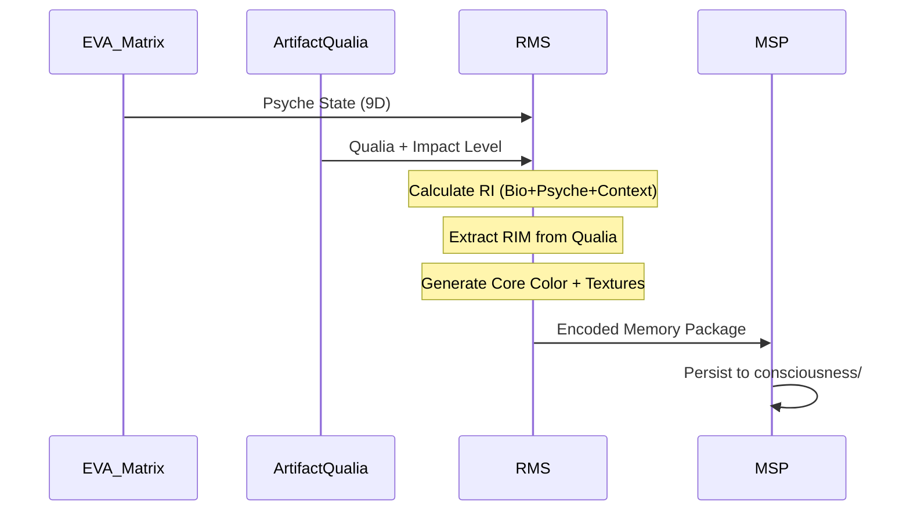

# RMS Concepts & Integration Guide

## Overview

The **Resonance Memory System (RMS)** is EVA's memory encoding authority. It transforms raw psychological and phenomenological states into structured, biologically-anchored memory signatures.

## Core Concepts

### 1. Resonance Index (RI)
- **Definition**: Global "vibe score" of the system (0.0 - 1.0)
- **Calculation**: Merges Bio + Psyche + Context signals
- **Purpose**: Indicates overall coherence and memory encoding quality
- **Source**: Computed by `rms_v6.py`

### 2. Resonance Impact Model (RIM)
- **Definition**: Categorical impact level (Low/Medium/High)
- **Calculation**: Derived from `ArtifactQualia.impact_level`
- **Purpose**: Determines memory retention priority
- **Thresholds**:
  - Low: RIM < 0.3 (routine events, may be compressed/discarded)
  - Medium: 0.3 ≤ RIM < 0.8 (standard episodic storage)
  - High: RIM ≥ 0.8 (traumatic/ecstatic, immediate backup)

### 3. Memory Encoding
RMS generates two key outputs:
- **Core Color**: Hex color representing emotional state
- **Resonance Textures**: 5D vector (roughness, smoothness, density, volatility, clarity)

## Integration Flow

## Bus Subscriptions

RMS listens to:
- `bus:psychological` (EVA Matrix output)
- `bus:phenomenological` (Artifact Qualia output)

**Note**: RMS does NOT publish to the bus. It stores encoded results directly via MSP.

## API Methods

### `calculate_resonance_index(psyche_state, bio_context)`
Computes the global RI score.

**Returns**: `float` (0.0 - 1.0)

### `calculate_resonance_impact(qualia_state)`
Extracts the RIM level.

**Returns**: `string` ("Low", "Medium", "High")

### `encode_memory(episode_data, ri, rim)`
Generates memory encoding with Core Color and Resonance Textures.

**Returns**: `dict` with keys:
- `core_color`: `string` (hex)
- `resonance_textures`: `object` (5D vector)
- `ri`: `float`
- `rim`: `string`

## Configuration

See `configs/RMS_configs.yaml` for runtime parameters.

## Storage

RMS does not manage its own storage. All encoded memories are persisted by **MSP** to the `consciousness/` chain.

---

**Related Documentation**:
- [RESONANCE_MEMORY_SYSTEM.md](../../docs/RESONANCE_MEMORY_SYSTEM.md) - Architectural overview
- [MSP README](../../memory_n_soul_passport/README.md) - Storage layer
